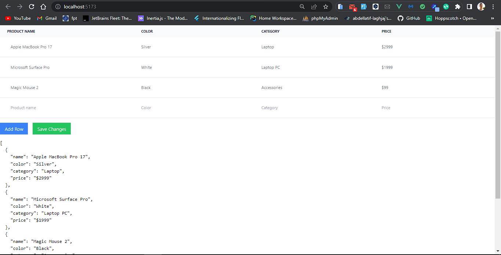

# Vue.js Editable Table

This is a simple editable table component built with Vue.js and Vite. It allows users to manage and manipulate data in a tabular format.

<!-- ## Screenshot -->
<!--  -->

## Features

- Add, edit, and delete rows of data
- Automatic data persistence using browser's local storage
- Input validation to ensure all fields are filled before adding a new row
- Confirmation prompt before saving changes
- Simple and intuitive user interface

## Installation

1. Clone the repository:

   ```bash
   git clone <repository_url>
   
2. Navigate to the project directory:
    ```bash
   cd vue-editable-table

3. Install dependencies using your preferred package manager:
    ```bash
    npm install or yarn install

4. Run the development server:
    ```bash
    npm run dev or yarn dev

5. Open your browser and visit ```http://localhost:5173/``` to see the editable table in action.

6. have fun 😺
